# Security Architecture Diagrams

Reference diagrams for enterprise security architecture patterns.

---

## Enterprise Security Architecture

### Defense in Depth Model

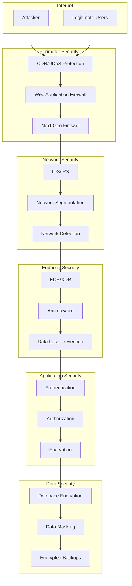

---

## Zero Trust Architecture

### Identity-Centric Security Model

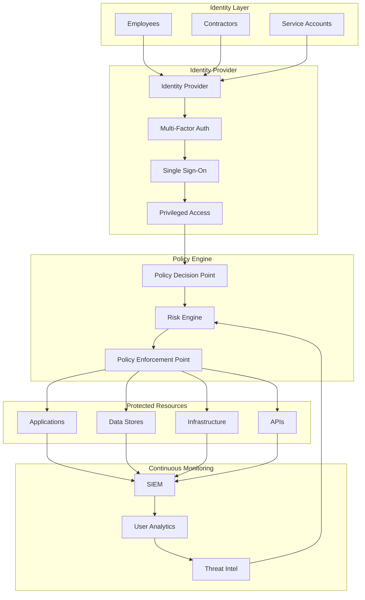

---

## Cloud Security Architecture (AWS)

### Multi-Account Security Design

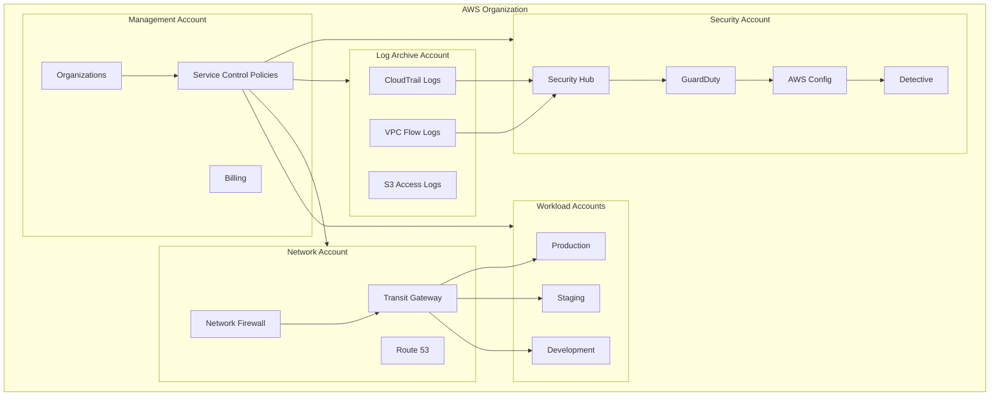

---

## SOC Architecture

### Security Operations Center Design

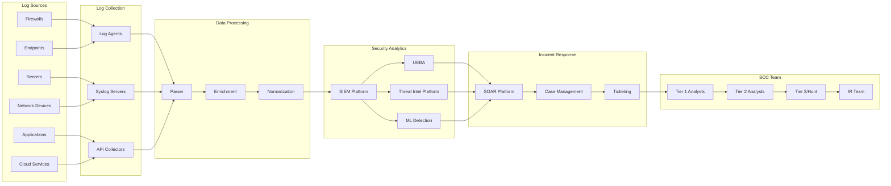

---

## Incident Response Flow

### IR Process Diagram

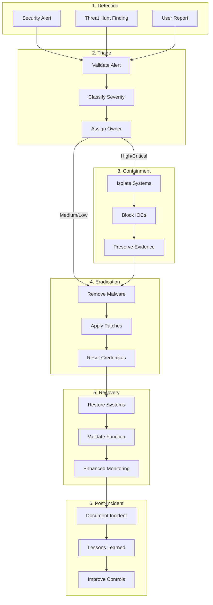

---

## Network Segmentation

### Micro-Segmentation Architecture

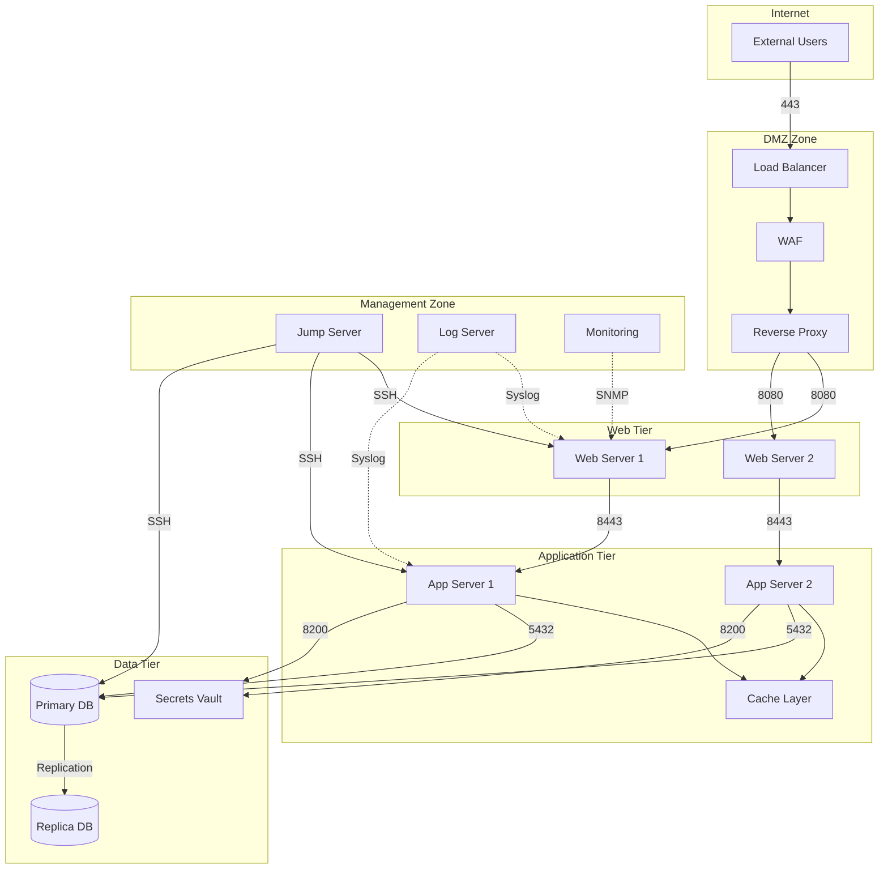

---

## Identity and Access Management

### IAM Architecture

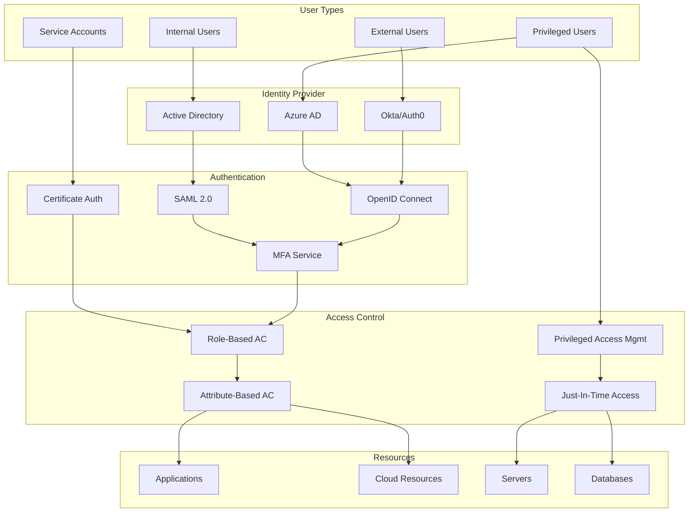

---

## Data Flow Security

### Secure Data Pipeline

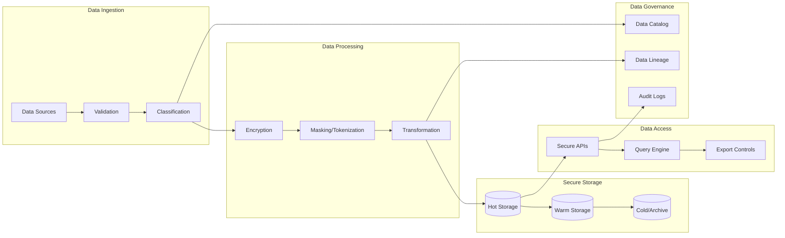

---

## Threat Detection Architecture

### Multi-Layer Detection

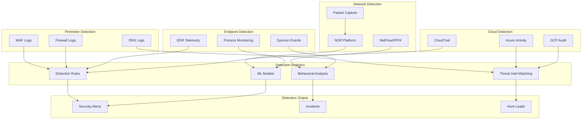

---

## DevSecOps Pipeline

### Secure CI/CD Architecture

```mermaid
flowchart LR
    subgraph Dev["Development"]
        CODE[Code Commit]
        PRESCAN[Pre-commit Hooks]
    end

    subgraph Build["Build Phase"]
        SAST[SAST Scan]
        SCA[Dependency Scan]
        SECRETS[Secret Detection]
        LINT[Security Linting]
    end

    subgraph Test["Test Phase"]
        DAST[DAST Scan]
        IAST[IAST Testing]
        PENTEST[Security Testing]
        FUZZ[Fuzzing]
    end

    subgraph Deploy["Deploy Phase"]
        IMGSCAN[Container Scan]
        IACSCAN[IaC Scan]
        POLICY[Policy Check]
        SIGN[Image Signing]
    end

    subgraph Runtime["Runtime"]
        RASP[RASP]
        CWPP[CWPP]
        CSPM[CSPM]
    end

    CODE --> PRESCAN
    PRESCAN --> SAST
    SAST --> SCA
    SCA --> SECRETS
    SECRETS --> LINT
    LINT --> DAST
    DAST --> IAST
    IAST --> PENTEST
    PENTEST --> FUZZ
    FUZZ --> IMGSCAN
    IMGSCAN --> IACSCAN
    IACSCAN --> POLICY
    POLICY --> SIGN
    SIGN --> RASP
    RASP --> CWPP
    CWPP --> CSPM
```

---

## Backup and Recovery Architecture

### Disaster Recovery Design

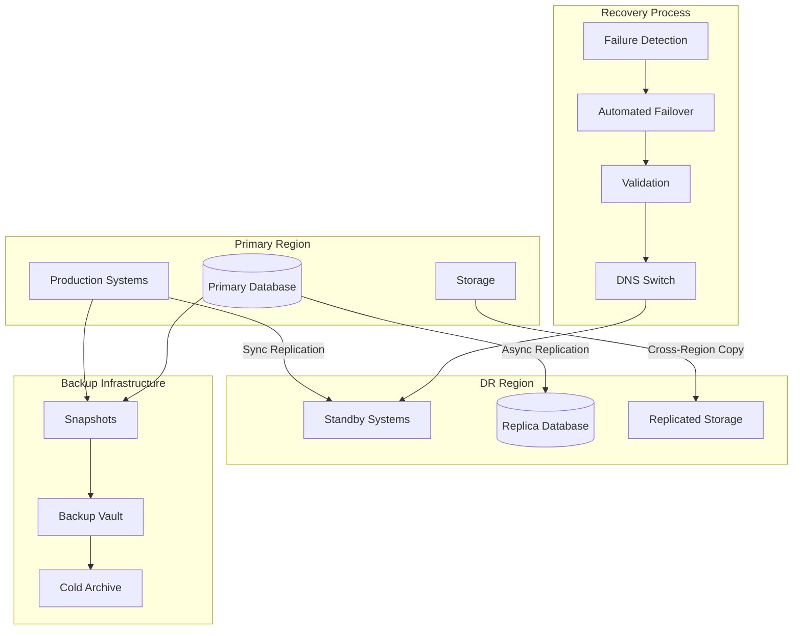

---

## Document Control

| Version | Date | Author | Changes |
|---------|------|--------|---------|
| 1.0 | 2024-01-15 | Security Architecture | Initial release |
